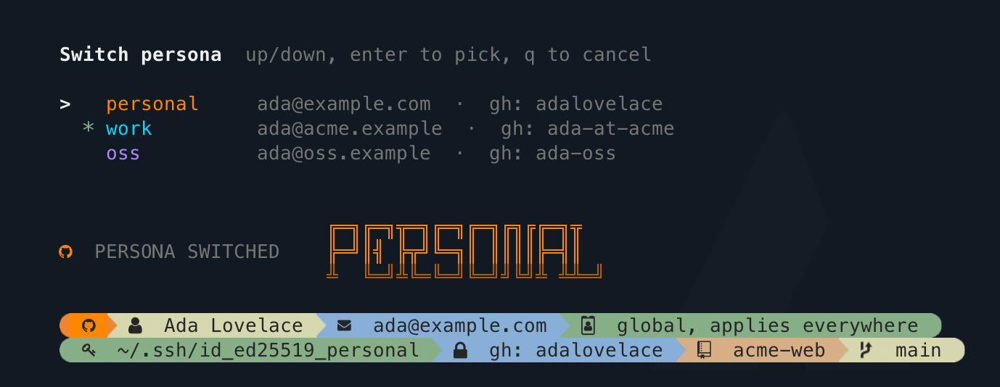

# zsh-git-persona

---



Git will happily let you commit as one person and push as another. It never warns
you, the push succeeds, and the wrong name is on that history for good.
`zsh-git-persona` makes that impossible: a **persona** ties one account's commit
identity, SSH key and `gh` login together, and switches them as a unit. Add as
many as you have accounts.

- [Why](#why)
- [Installation](#installation)
- [Updating](#updating)
- [Commands](#commands)
  - [Adding a persona](#adding-a-persona)
  - [What a switch actually sets](#what-a-switch-actually-sets)
  - [Commits waiting to be pushed](#commits-waiting-to-be-pushed)
- [Where your personas live](#where-your-personas-live)
- [Configuration](#configuration)
- [Requirements](#requirements)
- [Troubleshooting](#troubleshooting)
- [Uninstalling](#uninstalling)
- [Changelog](#changelog)
- [Licence](#licence)

## Why

Git treats **authorship** and **authentication** as unrelated, and nothing
warns you when they disagree:

- `user.email` is free text stamped into the commit. Git never verifies it.
- The token is what GitHub actually enforces.

So a commit can be signed as one account and pushed with another's credentials.
It succeeds, and the wrong name is on the history permanently. Setting only the
email, as most multi-account guides suggest, does not prevent this.

This plugin moves identity, key and login together, and `git-who` tells you when
something is out of step.

## Installation

**oh-my-zsh**, clone, enable and reload in one go:

```zsh
git clone https://github.com/asifshirazi/zsh-git-persona.git $ZSH_CUSTOM/plugins/git-persona && omz plugin enable git-persona && exec zsh
```

`omz` is oh-my-zsh's own CLI, so it edits `plugins=(...)` correctly whether yours
is on one line or several, and says so rather than duplicating if the plugin is
already enabled. On an oh-my-zsh too old to have it, add `git-persona` to
`plugins=(...)` in `~/.zshrc` by hand, then run `source ~/.zshrc` or `exec zsh`.
Either picks it up in the shell you already have open.

**Other plugin managers**

```zsh
zinit light asifshirazi/zsh-git-persona
```

```zsh
antidote bundle asifshirazi/zsh-git-persona
```

```zsh
sheldon add git-persona --github asifshirazi/zsh-git-persona
```

**Plain zsh**

```zsh
source /path/to/zsh-git-persona/git-persona.plugin.zsh
```

Then `source ~/.zshrc` (or `exec zsh`) and run `git-add`.

### Quick start

A persona is built around an SSH key, so you need one per account in `~/.ssh`
before `git-add` has anything to offer. If you already have them, skip the first
line.

```zsh
ssh-keygen -t ed25519 -C "you@example.com" -f ~/.ssh/id_ed25519_work
git-add          # add your first persona, once per account
git-switch       # pick one, any time
git-who          # check which one is live
```

The `-C` comment is where the commit email comes from. Add the matching `.pub`
to that account under [Settings > SSH keys](https://github.com/settings/keys),
and see [Requirements](#requirements) for the detail.

## Updating

```zsh
git -C $ZSH_CUSTOM/plugins/git-persona pull && exec zsh
```

Pull rather than clone again. Cloning over an existing install fails with
`destination path already exists and is not an empty directory`.

With another plugin manager, use its own update command instead: `zinit update
asifshirazi/zsh-git-persona`, `antidote update`, or `sheldon lock --update`.

Your personas are not touched. They live in `~/.config/git-persona/`, outside
the plugin directory, so updating and even reinstalling leaves them alone.

Check what you are running with:

```zsh
print $GIT_ID_VERSION
```

**Coming from a version before 1.0.3, run this once:**

```zsh
gh auth setup-git
```

1.0.3 fixed a bug where any persona could clone and push to private repos its
account had no access to, because HTTPS traffic was authenticating with a token
cached by the system keychain rather than with the selected account. New
personas get the fix automatically from `git-add`, but personas added earlier do
not, so run the command above once per machine. `git-who` warns if it is still
needed.

## Commands

| Command | Does |
|---|---|
| `git-add` | Add a persona. Signs you into `gh`, reads the rest from the key and the account. |
| `git-switch` | Pick a persona from an arrow-key list and switch to it. |
| `git-<persona>` | Switch straight to that persona. Created for each one you add. |
| `git-who` | Show the persona in force, and warn if its parts disagree. |
| `git-remove` | Drop a persona, its `~/.ssh/config` alias, and its `gh` token. |
| `git-id-locals` | Find repos pinned to their own identity that ignore the global one. |
| `git-id-locals --clear` | Unpin them, so they all follow the global identity. |
| `git-id-icons` | Check whether your font has the glyphs. |

### Adding a persona

`git-add` lists the private keys in `~/.ssh` and asks three things. Everything
else it works out for itself:

```text
   keys in ~/.ssh  up/down, enter to pick
   > id_ed25519_work
     id_ed25519_personal
     + generate a new key

   email from id_ed25519_work.pub: ada@acme.example
   short name, used as git-<name>: work

   sign in to the github account this persona should use
   the one-time code is copied to your clipboard automatically
   ...
   signed in as ada-at-acme
   name from github: Ada Lovelace
```

The commit email comes from the key's `.pub` comment, the display name from
your GitHub profile, and the colours from a built-in palette. When it finishes
it switches you straight into the new persona.

**No key yet?** Pick `+ generate a new key`, or just run `git-add` with an empty
`~/.ssh` and it goes there by itself. It makes an ed25519 pair with the
account's address as the comment, copies the public half to your clipboard, and
opens <https://github.com/settings/ssh/new> so you can paste it straight in. The
key is also printed in case the clipboard gets clobbered on the way. Because the
comment is set to the address you typed, the email step reads it back instead of
asking twice. Existing files are never overwritten, and `ssh-keygen` asks for
the passphrase itself.

### What a switch actually sets

All global, so one command governs every repo on the machine:

| | |
|---|---|
| `user.name`, `user.email` | `~/.gitconfig` |
| `core.sshCommand` (with `IdentitiesOnly=yes`) | `~/.gitconfig` |
| Active `gh` account | `~/.config/gh/hosts.yml` |

Both halves matter, because git authenticates two different ways:

- **SSH remotes** use the key in `core.sshCommand`. `IdentitiesOnly=yes` is
  included because `-i` alone only *adds* a key to the ones ssh offers, and
  ssh-agent's keys are still offered first. GitHub accepts the first key that
  matches any account, so without the flag the persona would be decided by
  agent order.
- **HTTPS remotes** use the credential helper, which is why `git-add` runs
  `gh auth setup-git` once. See [Requirements](#requirements).

It survives new shells and reboots. A repo with its own `user.email` still
outranks the global one; `git-who` flags that and `git-id-locals --clear` fixes
it.

### Commits waiting to be pushed

`git commit` never checks permissions. It writes to `.git/` on your own disk,
with no server involved, so any repo will accept a commit under any identity.
Permission exists only at push time. That leaves one way to end up with the
wrong name on a commit: commit under one persona, switch, then push — by which
point both halves agree again and nothing looks wrong.

So a switch checks, and asks:

```text
   2 unpushed commits authored as old@example.com
   re-author to New Name <new@example.com>? [y/N]
```

It is deliberately narrow:

- **Unpushed only.** Commits reachable from `HEAD` but from no remote branch.
  They have never left your machine, so nothing needs a force push and nobody's
  clone breaks. Already-pushed commits are shared history and are left alone.
- **Yours only.** Only commits authored by another of your personas. A
  cherry-pick or a mailed patch from a colleague keeps its author.
- **It refuses rather than half-finishing.** A dirty tree, a detached `HEAD`, a
  rebase in progress, or a merge among the pending commits all stop it with an
  explanation, having changed nothing.
- **Never silent.** Rewriting commits changes their hashes, so it is always a
  question. Say no and the readout reminds you the mismatch is still there.

To fix a commit that is *already* pushed you have to rewrite shared history
yourself, which is a decision worth making deliberately:

```zsh
git commit --amend --reset-author --author="Name <you@example.com>"
git push --force-with-lease
```

## Where your personas live

In `~/.config/git-persona/profiles.zsh`, never in the plugin. One readable
block per persona, safe to edit by hand:

```zsh
git-id-profile personal                    \
    name    'Your Name'                    \
    email   'you@example.com'              \
    key     '~/.ssh/id_rsa_personal'       \
    gh      'yourname'                     \
    accent  208                            \
    shadow  130
```

The file is created on your first `git-add`. Installing the plugin writes
nothing.

## Configuration

Set any of these in `~/.zshrc` **before** the plugin loads.

| Variable | Default | Purpose |
|---|---|---|
| `GIT_ID_PROFILE_FILE` | `~/.config/git-persona/profiles.zsh` | Where personas are stored |
| `GIT_ID_SSH_CONFIG` | `~/.ssh/config` | Which ssh config to maintain |
| `GIT_ID_SCAN_ROOTS` | common code dirs | Where `git-id-locals` looks |
| `GIT_ID_MENU` | `arrows` | `numbers` to disable arrow-key pickers |
| `GIT_ID_AUTO_LOGIN` | `ask` | `always` or `never` for `gh auth login` |
| `GIT_ID_PALETTE` | 10 colours | Accents handed to new personas, neutral once used up |
| `GIT_ID_SEG_*` | muted tones | Colours of the readout bars |

## Requirements

- zsh, git, and the [GitHub CLI](https://cli.github.com) (`gh`)
- **HTTPS auth routed through `gh`.** Switching personas moves `gh`'s active
  account, but that only governs `git clone` and `git push` if git actually
  asks `gh` for the password. It does not by default: git collects credential
  helpers from every scope, and on macOS `/etc/gitconfig` ships
  `helper = osxkeychain`, which answers first with whichever token it cached on
  your very first push. That token belongs to one account permanently, so
  **every persona would clone and push as that one account.**

  `git-add` runs `gh auth setup-git` for you, and `git-who` warns if it is ever
  undone. To check or fix it by hand:

  ```zsh
  git config --get-urlmatch credential.helper https://github.com   # want: gh
  gh auth setup-git                                                # if not
  ```
- **An SSH key per account, in `~/.ssh`, each with its `.pub` beside it.** A
  persona is built around a key, and the `.pub` is what the commit email is read
  from. You do not need to make them first: `git-add` offers
  `+ generate a new key` and walks you through it. To do it by hand instead:

  ```zsh
  ssh-keygen -t ed25519 -C "you@example.com" -f ~/.ssh/id_ed25519_work
  ```

  Then add the public half to that GitHub account under
  [Settings > SSH keys](https://github.com/settings/keys).
- A [Nerd Font](https://www.nerdfonts.com) is **optional**. Without one you get
  ASCII markers instead of icons and the layout is unaffected. Run
  `git-id-icons` to check. Outside a UTF-8 locale it falls back automatically.

Developed on macOS. Everything works elsewhere except two extras, which switch
themselves off rather than failing:

- **Device code to clipboard** needs `pbcopy`, `wl-copy`, `xclip` or `xsel`, and
  a BSD `script(1)`. Otherwise `gh auth login` simply runs normally.
- **`~/.ssh/config` file mode** is preserved via `stat`, with a GNU fallback.

## Troubleshooting

**A persona can clone or push to a repo its account has no access to.** HTTPS
auth is not going through `gh`, so git is reusing a cached token from another
account. Check with `git config --get-urlmatch credential.helper
https://github.com`; if the answer is not `gh`, run `gh auth setup-git`.
`git-who` reports this too.

**`git-persona: no persona named 'x'`.** Run `git-switch` with no argument to
see what exists, or `git-add` to create it.

**Commits still show the wrong name.** A repo with its own `user.email` outranks
the global one. `git-who` says `overridden on this repo` when that is happening;
`git-id-locals` lists every repo doing it and `--clear` unpins them.

**Pushes still authenticate as the wrong account.** The `gh` account is separate
from the commit identity, and `gh`'s active account is machine-wide rather than
per shell, so a switch in one terminal moves it for all of them. `git-who` shows
which account is live next to the key.

**Boxes instead of icons.** No Nerd Font. Run `git-id-icons`: a blank between
brackets means the font has no glyph there. Nothing but the icons is affected.

**`fatal: destination path ... already exists and is not an empty directory`.**
The plugin is already installed. To update it, `git -C
$ZSH_CUSTOM/plugins/git-persona pull`. To reinstall from scratch, remove the
directory first with `rm -rf $ZSH_CUSTOM/plugins/git-persona`.

**`git-add` shows no keys to pick from.** There are no private keys in `~/.ssh`,
so it offers to generate one. Keys are found by content rather than by filename,
so anything without a `PRIVATE KEY` header is skipped. If your key lives outside
`~/.ssh`, turn the arrow menu off with `GIT_ID_MENU=numbers` and type its path
at the prompt.

**It asked for the email instead of reading it.** The key has no `.pub` beside
it, or that file's comment is a hostname rather than an address, which is what
`ssh-keygen` writes when given no `-C`. Type the email and carry on, or
regenerate the public half with `ssh-keygen -y -f <key> > <key>.pub`.

**Edited the persona file by hand and nothing changed.** Run `source ~/.zshrc`.
Additions and removals are both picked up: a new block gets its `git-<persona>`
command, and a deleted one has its command removed.

**An eleventh persona looks grey.** The palette holds ten accents. Beyond that
personas fall back to a neutral colour and work normally. Set `accent` and
`shadow` in the block by hand, or extend `GIT_ID_PALETTE`, to colour them.

## Uninstalling

```zsh
omz plugin disable git-persona; rm -rf $ZSH_CUSTOM/plugins/git-persona
```

A semicolon, not `&&`. `omz plugin disable` exits non-zero when the plugin is
not currently enabled, which would otherwise skip the removal and leave the
directory in place to break your next install.

Your personas stay in `~/.config/git-persona/`, and the last identity a switch
wrote stays in `~/.gitconfig`. Delete both by hand if you want them gone.

## Changelog

Every release is listed in [CHANGELOG.md](CHANGELOG.md). Current version 1.1.2.
The plugin sets `$GIT_ID_VERSION`, so `print $GIT_ID_VERSION` gives you the
number for a bug report.

## Licence

[MIT](LICENSE)
